# Protein Distance Diffusion

Stage 1 implements unconditional generation of continuous protein residue-distance matrices conditioned on residue count:

`D ~ p_theta(D | N)`, where `D[i, j]` is the Euclidean distance in angstrom between the C-alpha atoms of residues `i` and `j`.

The model learns a distribution, not a deterministic function `D = f(N)`. Different noise seeds at the same length `N` should produce different plausible distance maps. This stage does not generate amino-acid sequences, reconstruct coordinates, predict coordinates, or train with triangle, EDM, bond-length, or steric losses.

## Repository Structure

- `src/protein_distance_diffusion/`: package source.
- `scripts/`: command-line entry points for download, preprocessing, splitting, statistics, training, sampling, summaries, and visualization.
- `configs/`: documented YAML defaults.
- `tests/`: unit and smoke tests with tiny synthetic fixtures.
- `requirements.txt` and `requirements-dev.txt`: convenience installation files; `pyproject.toml` remains the canonical dependency source.

## Distance Maps And Contact Maps

The training target is always the continuous matrix `D in R^(N x N)` in angstrom. Binary contact maps are derived only for diagnostics and visualization:

`C_ij^(tau) = 1[D_ij < tau]`

The documented visualization default is `tau = 8.0 A`. The diagonal is excluded from contact statistics, and near-diagonal sequence contacts can be excluded explicitly with `--exclude-near-diagonal`.

## Environment Setup

Linux with Python 3.11 is the primary target:

```bash
cd /home/simostocco/proteinGen

python3.11 -m venv .venv
source .venv/bin/activate

python -m pip install --upgrade pip setuptools wheel
```

Install the appropriate PyTorch build first. CPU example:

```bash
python -m pip install torch --index-url https://download.pytorch.org/whl/cpu
```

For CUDA, use the exact command from the official PyTorch installation selector for your driver/CUDA combination. Do not blindly install a CUDA-specific wheel on CPU-only machines.

Then install the project dependencies and editable package:

```bash
python -m pip install -r requirements.txt
python -m pip install -r requirements-dev.txt
python -m pip install -e .
```

Verify:

```bash
python -c "import torch; print('PyTorch:', torch.__version__)"
python -c "import MDAnalysis as mda; print('MDAnalysis:', mda.__version__)"
python -c "import gemmi; print('Gemmi:', gemmi.__version__)"
python -c "import protein_distance_diffusion; print('Package import successful')"

pytest -q
ruff check .
```

Use `source .venv/bin/activate` to reactivate the environment and `deactivate` to leave it.

Troubleshooting:

- If `python3.11` is missing, install it with your system package manager or use another Python `>=3.11` supported by the dependencies.
- If PyTorch reports NumPy ABI errors, reinstall compatible PyTorch/NumPy wheels inside the clean virtual environment.
- If `gemmi` is missing, install runtime requirements again; Gemmi is required for mmCIF.
- If CUDA is not detected, reinstall the PyTorch build matching your driver and CUDA runtime.
- MMseqs2 is an external executable, not a Python package. Install it separately and ensure `mmseqs` is on `PATH`.

## Parser Backends

Both Gemmi and MDAnalysis are runtime dependencies by design:

- `.cif`, `.mmcif`, `.cif.gz`, `.mmcif.gz`: Gemmi backend.
- `.pdb`, `.ent`, `.pdb.gz`, `.ent.gz`: MDAnalysis backend.
- future topology-plus-trajectory inputs: MDAnalysis backend.

All backends are converted into the same internal `ProteinSample` representation: PDB ID, model/frame ID, chain ID, sequence, residue identifiers, C-alpha coordinates `[N, 3]`, metadata, and later the stored distance matrix `[N, N]`.

## Pipeline

```mermaid
flowchart LR
  A[PDB mmCIF or PDB] --> B[backend selection]
  B --> C[chain filtering]
  C --> D[C-alpha extraction]
  D --> E[D calculation]
  E --> F[exact deduplication]
  F --> G[MMseqs2 clustering]
  G --> H[cluster-level splits]
  H --> I[training-only normalization]
  I --> J[variable-size DataLoader]
  J --> K[conditional U-Net diffusion]
  K --> L[generated distance matrices]
  L --> M[evaluation and visualization]
```



Distance matrices are never resized or interpolated. Batches are padded to a side length divisible by the U-Net downsampling factor; padded values are masked out. The sequence-separation channel is created during collation as `abs(i-j) / max(N-1, 1)`.

## First Real-Data Experiment

Create a pilot ID file, one PDB ID per line:

```bash
mkdir -p data
printf "1ubq\n4hhb\n1crn\n" > data/pdb_ids.txt
```

Download a bounded pilot dataset in mmCIF format:

```bash
python scripts/download_pdb.py \
  --ids-file data/pdb_ids.txt \
  --output-dir data/raw/mmcif \
  --manifest data/raw/download_manifest.csv \
  --max-entries 20 \
  --delay-seconds 0.2
```

Preprocess:

```bash
python scripts/preprocess_pdb.py --config configs/preprocess.yaml
```

The default preprocessing config uses `min_length: null`, meaning no lower length
constraint, and keeps `max_length: 128`. Set `min_length` to a positive integer to
enable a lower bound.
`allowed_methods` is enforced as an exact list when non-null; set
`allowed_methods: null` to disable method filtering. X-ray and cryo-EM resolution
thresholds are applied only to `X-RAY DIFFRACTION` and `ELECTRON MICROSCOPY`,
respectively. Non-finite, zero, or negative resolutions are treated as missing.

Visualize processed samples:

```bash
python scripts/visualize_samples.py \
  --manifest data/processed/manifest.parquet \
  --output-dir outputs/dataset_samples \
  --num-samples 8 \
  --seed 42 \
  --contact-threshold 8.0
```

Summarize:

```bash
python scripts/summarize_dataset.py \
  --manifest data/processed/manifest.parquet \
  --output-dir reports/dataset \
  --preprocessing-summary data/processed/preprocess_summary.json
```

Cluster retained sequences with MMseqs2 or provide `data/processed/mmseqs_clusters.tsv`, then split:

```bash
python scripts/build_splits.py --config configs/split.yaml
python scripts/compute_train_statistics.py \
  --train-manifest data/splits/train.parquet \
  --output data/processed/normalization.json
```

Train and sample:

```bash
python scripts/train_diffusion.py --config configs/train.yaml
python scripts/sample_distance_maps.py \
  --checkpoint outputs/experiment/checkpoints/latest.pt \
  --length 96 \
  --num-samples 16 \
  --output-dir outputs/samples/N96
```

## Preventing Data Leakage

Random PDB-ID splitting is insufficient because homologous proteins, duplicate chains, and related structures can appear under different entries. This code hashes exact sequences and keeps one deterministic representative by default. Retained sequences are clustered with MMseqs2, then whole clusters are assigned to train, validation, or test. Hard assertions reject cluster, exact-sequence, sample-ID, and retained PDB-chain overlap across splits.

Normalization is computed after splitting from valid upper-triangular training distances only. Validation and test files are not read by the statistics command.

Sequence clustering reduces homolog leakage, but low-sequence-identity proteins can still share folds. The split code is designed so external CATH or SCOP grouping labels can be merged into the group ID in future experiments.

## Recommended Progression

Experiment A: parser and visualization check.

Download 10-20 structures, preprocess them, generate all visualizations, and manually inspect residue ordering, backbone traces, and distance-map patterns.

Experiment B: pilot dataset.

Download 100-500 entries, use configurable length filters such as `min_length: 40` and
`max_length: 256`, record rejection causes, deduplicate exact sequences, run MMseqs2
clustering, produce leakage-safe splits, and generate dataset statistics.

Experiment C: model overfitting test.

Select 16-32 similar-length samples, train until the loss drops strongly, sample at matching lengths, and check symmetry, zero diagonal, distance distributions, and visual structure. Only then move to mixed-length pilot training.

## Architecture

For `N=128` with channel multipliers `[1, 2, 4, 8]`, collation produces `[B, 1, 128, 128]` distance matrices plus `[B, 1, 128, 128]` sequence-separation and pair-mask channels. The model input is `[B, 3, 128, 128]`. Downsampling gives spatial sizes `128 -> 64 -> 32 -> 16`; masked multi-head attention operates on `16*16` bottleneck tokens; upsampling restores `128`. The output is `[B, 1, 128, 128]`, then it is symmetrized, has the diagonal set to zero, and is multiplied by the pair mask.

## Expected Outputs

- `data/raw/download_manifest.csv`: download status by PDB ID.
- `data/processed/samples/*.npz`: processed samples.
- `data/processed/manifest.parquet`: processed manifest.
- `data/processed/preprocess_summary.json`: accepted/rejected preprocessing counts.
- `data/splits/*.parquet` and `data/splits/split_audit.json`: leakage-safe splits.
- `data/processed/normalization.json`: train-only normalization.
- `reports/dataset/`: summary JSON and plots.
- `outputs/dataset_samples/`: sample visualization PNGs.
- `outputs/experiment/`: logs and checkpoints.
- `outputs/samples/`: generated distance matrices and heatmaps.

## Validation

```bash
python -m py_compile $(rg --files -g '*.py')
pytest -q
ruff check .
ruff format --check .
```

## Limitations

The baseline does not model sequences or coordinates. The 3D trace in visualization is a plot of input C-alpha coordinates only. Topology-plus-trajectory support is intentionally only prepared at the backend interface level; a molecular-dynamics dataset pipeline is not implemented in this stage.
