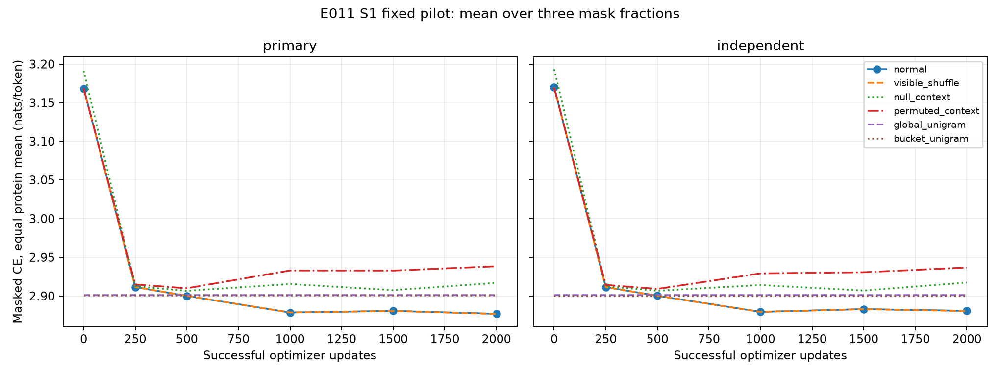
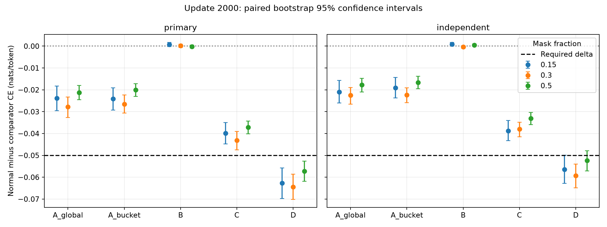

# E011 S1 bounded real-data pilot — S1-E

## 1. Executive classification

**S1-E — inconclusive under the sealed classifier.** This is the sealed classifier result after exactly 2,000 successful optimizer updates. The conclusion is bounded by this pilot budget; it does not adjudicate unlimited-training capacity. All integrity and execution checks passed. The S1-E label reflects the sealed mixed-gate decision rule, not an infrastructure failure. Across the full panels, A and C miss the 0.05-nat effect; B shows no ordered-context advantage; D passes. The partial donor-context signal is consistent with composition cues and does not verify ordered dependencies.

## 2. Contract and reproducibility

Preparation: `ef30a6f759a4032e89c6be881c4c137f5de6dac7`. Implementation: `429221ac957b340bc5198ea17ea6b8c34ba8101b`. Execution contract SHA256: `e0a0917b78e35178da7e9d78d7edfbbcb79db1581902174f165ca2de756d38d6`. The original scientific contract, source, masks, loss, baselines and gates remain byte-identical. The operational contract adds the authorized budget, physical batching and disjoint primary panel. Scratch seed 6011; float32; deterministic algorithms; AdamW 1e-4 with 1,000-update warmup, weight decay 0.01, gradient clipping 1.0. Checkpoints contain model, optimizer, CPU/CUDA/Python/NumPy RNG states and schedule epoch/cursor.

## 3. Dataset integrity

All 744 raw shards (5,422,690,052 bytes) match their inventory and protocol hashes. All projected sequences match canonical tokens; 231,743 train and 23,307 validation rows. Zero cross-split sample, exact sequence, PDB, cluster or split-group overlap. Historical homology policy: 30% identity, 80% coverage. TRAIN baseline recomputation matches the seal. Sequence caches contain only sample_id, split, sequence and token_ids. Geometry is never materialized by the S1 reader/model. The primary 2,048 validation identities are disjoint from the independent 2,048 panel; both span all strata.

## 4. Tests and quality

The full suite was executed. Direct-worktree failures were missing historical dependencies. An E011-local test mirror supplied read-only reports/checkpoints/caches/logs and environment YAML, and five byte-identical local fixtures needed by repository containment checks. Mirror full run: 1,612 passed, 21 fixture failures, 13 conditional skips; all 21 repaired cases subsequently passed. Final E011 tests: 14 passed, including the additional batched diagnostic parity test. Pre-execution unique coverage: 1,634 passed, 13 skipped, zero unresolved failures. After the pilot, all 11 CUDA-skipped cases passed on the idle GPU: combined unique coverage 1,645 passed, two conditional skips, zero unresolved failures. The remaining skips are the opt-in live RCSB API test and missing optional pilot mmCIF fixtures. No tests were weakened. Ruff lint/format, Python syntax and Git whitespace checks pass. See quality_gates.json, postflight_quality.json and preserved local logs for exact evidence.

## 5. CUDA smoke

RTX 5060; float32 without mixed precision. Forward, backward, optimizer mutation, finite gradients/state, deterministic masks, paired CPU/CUDA dropout RNG and single net RNG advancement passed. Physical batches 32/16/8/8 for maximum lengths 128/256/384/500; accumulation 1. Peak allocated 1,393 MiB and reserved 1,440 MiB (about 1.36/1.41 GiB). No Phase 4C process remained before execution.

## 6. Training trajectory

| Update | Primary normal CE | Independent normal CE |
| --- | --- | --- |
| 0 | 3.168302 | 3.169947 |
| 250 | 2.911353 | 2.911429 |
| 500 | 2.900020 | 2.900188 |
| 1000 | 2.878514 | 2.879352 |
| 1500 | 2.880582 | 2.882896 |
| 2000 | 2.876863 | 2.880683 |

Processed 30,952 proteins and 5,672,710 valid tokens. Telemetry records every successful update: both CEs, gap, hinge, active hinge fraction, gradient norm, clipping, LR, fraction, lengths and exposure counts. No scientific early stopping or extension occurred. Immutable checkpoints exist at all six boundaries.

## 7. Uniform and TRAIN unigram baselines

| Population | Uniform | Global unigram | Length-bucketed unigram |
| --- | --- | --- | --- |
| primary | 2.995732 | 2.901167 | 2.900441 |
| independent | 2.995732 | 2.901103 | 2.900023 |

## 8. Normal context

| Population | Paired delta [95% CI], gate |
| --- | --- |
| primary | -0.024305 [-0.028109, -0.020786] FAIL |
| independent | -0.020420 [-0.023479, -0.017226] FAIL |

## 9. Visible-shuffle comparison

| Population | Paired delta [95% CI], gate |
| --- | --- |
| primary | +0.000247 [-0.000269, +0.000714] FAIL |
| independent | +0.000294 [-0.000140, +0.000685] FAIL |

## 10. Null-context comparison

| Population | Paired delta [95% CI], gate |
| --- | --- |
| primary | -0.040035 [-0.043508, -0.036861] FAIL |
| independent | -0.036598 [-0.039524, -0.033820] FAIL |

## 11. Permuted-context comparison

| Population | Paired delta [95% CI], gate |
| --- | --- |
| primary | -0.061479 [-0.066384, -0.056638] PASS |
| independent | -0.056056 [-0.060763, -0.051679] PASS |

## 12. Mask-fraction results

| Population | Mask | Normal CE | A global | A bucket | B shuffle | C null | D donor |
| --- | --- | --- | --- | --- | --- | --- | --- |
| primary | 0.15 | 2.875554 | -0.023893 [-0.029536, -0.018299] FAIL | -0.024153 [-0.029297, -0.019070] FAIL | +0.000750 [-0.000205, +0.001739] FAIL | -0.039801 [-0.044730, -0.034946] FAIL | -0.062714 [-0.069741, -0.055759] PASS |
| primary | 0.3 | 2.875948 | -0.027824 [-0.032691, -0.023342] FAIL | -0.026498 [-0.030660, -0.022412] FAIL | +0.000137 [-0.000599, +0.000828] FAIL | -0.043106 [-0.047423, -0.039067] FAIL | -0.064442 [-0.070168, -0.058580] PASS |
| primary | 0.5 | 2.879087 | -0.021197 [-0.024545, -0.017940] FAIL | -0.020083 [-0.023032, -0.017148] FAIL | -0.000148 [-0.000841, +0.000525] FAIL | -0.037198 [-0.040199, -0.034249] FAIL | -0.057281 [-0.061812, -0.052602] PASS |
| independent | 0.15 | 2.880114 | -0.021012 [-0.026057, -0.015755] FAIL | -0.019130 [-0.023746, -0.014362] FAIL | +0.000830 [+0.000039, +0.001630] FAIL | -0.038713 [-0.043211, -0.034068] FAIL | -0.056447 [-0.062853, -0.049872] PASS |
| independent | 0.3 | 2.878797 | -0.022488 [-0.026556, -0.018884] FAIL | -0.022295 [-0.025816, -0.019041] FAIL | -0.000405 [-0.001065, +0.000226] FAIL | -0.038014 [-0.041488, -0.034861] FAIL | -0.059322 [-0.064827, -0.053927] PASS |
| independent | 0.5 | 2.883139 | -0.017760 [-0.020971, -0.014706] FAIL | -0.016595 [-0.019495, -0.013809] FAIL | +0.000458 [-0.000141, +0.001061] FAIL | -0.033065 [-0.035913, -0.030368] FAIL | -0.052399 [-0.057076, -0.047938] PASS |

## 13. Length-stratum results

| Population | Mask | Length | N | Normal CE | A global | A bucket | B shuffle | C null | D donor |
| --- | --- | --- | --- | --- | --- | --- | --- | --- | --- |
| primary | 0.15 | 20–64 | 410 | 2.852155 | -0.064558 [-0.088412, -0.039737] PASS | -0.066952 [-0.088010, -0.046230] PASS | +0.001364 [-0.003005, +0.005921] FAIL | -0.069604 [-0.090772, -0.048108] PASS | -0.143470 [-0.172520, -0.114412] PASS |
| primary | 0.15 | 65–128 | 410 | 2.885774 | -0.016272 [-0.027235, -0.006160] FAIL | -0.020598 [-0.031119, -0.010345] FAIL | +0.001667 [+0.000006, +0.003482] FAIL | -0.034455 [-0.043829, -0.025321] FAIL | -0.049976 [-0.064591, -0.036907] FAIL |
| primary | 0.15 | 129–256 | 410 | 2.881255 | -0.013993 [-0.020300, -0.008082] FAIL | -0.015444 [-0.021790, -0.009579] FAIL | -0.000057 [-0.001013, +0.000928] FAIL | -0.033322 [-0.039622, -0.027452] FAIL | -0.048376 [-0.057205, -0.039919] FAIL |
| primary | 0.15 | 257–384 | 409 | 2.880481 | -0.008491 [-0.012610, -0.004271] FAIL | -0.006993 [-0.011215, -0.002627] FAIL | +0.000632 [-0.000134, +0.001385] FAIL | -0.028894 [-0.032903, -0.024451] FAIL | -0.036794 [-0.041968, -0.031608] FAIL |
| primary | 0.15 | 385–500 | 409 | 2.878122 | -0.016095 [-0.020241, -0.012000] FAIL | -0.010705 [-0.014642, -0.006913] FAIL | +0.000144 [-0.000422, +0.000661] FAIL | -0.032687 [-0.036661, -0.028587] FAIL | -0.034820 [-0.039385, -0.030578] FAIL |
| primary | 0.3 | 20–64 | 410 | 2.852719 | -0.080124 [-0.101153, -0.061514] PASS | -0.074956 [-0.092331, -0.057892] PASS | +0.000131 [-0.002873, +0.003403] FAIL | -0.084631 [-0.102611, -0.067860] PASS | -0.147974 [-0.171698, -0.125327] PASS |
| primary | 0.3 | 65–128 | 410 | 2.878775 | -0.023136 [-0.030178, -0.015668] FAIL | -0.026511 [-0.033326, -0.019452] FAIL | +0.000168 [-0.001078, +0.001460] FAIL | -0.036248 [-0.042754, -0.029579] FAIL | -0.054844 [-0.064734, -0.045782] PASS |
| primary | 0.3 | 129–256 | 410 | 2.882264 | -0.013357 [-0.019304, -0.007880] FAIL | -0.014915 [-0.020939, -0.009481] FAIL | +0.000431 [-0.000392, +0.001292] FAIL | -0.032205 [-0.037422, -0.027035] FAIL | -0.047038 [-0.054679, -0.040132] FAIL |
| primary | 0.3 | 257–384 | 409 | 2.884837 | -0.008901 [-0.012109, -0.005479] FAIL | -0.007087 [-0.010312, -0.003650] FAIL | -0.000147 [-0.000738, +0.000405] FAIL | -0.030527 [-0.033849, -0.027267] FAIL | -0.038233 [-0.043217, -0.033721] FAIL |
| primary | 0.3 | 385–500 | 409 | 2.881179 | -0.013523 [-0.017043, -0.010072] FAIL | -0.008932 [-0.012321, -0.005654] FAIL | +0.000102 [-0.000359, +0.000564] FAIL | -0.031861 [-0.035596, -0.028506] FAIL | -0.033981 [-0.037954, -0.030400] FAIL |
| primary | 0.5 | 20–64 | 410 | 2.866959 | -0.060059 [-0.073162, -0.046760] PASS | -0.056145 [-0.067755, -0.045239] PASS | +0.000033 [-0.002639, +0.003027] FAIL | -0.065124 [-0.076913, -0.053345] PASS | -0.130930 [-0.148555, -0.112680] PASS |
| primary | 0.5 | 65–128 | 410 | 2.884420 | -0.014653 [-0.020466, -0.009072] FAIL | -0.018314 [-0.023681, -0.012951] FAIL | -0.000210 [-0.001540, +0.001094] FAIL | -0.029740 [-0.034763, -0.024567] FAIL | -0.050287 [-0.058755, -0.042315] PASS |
| primary | 0.5 | 129–256 | 410 | 2.880237 | -0.011329 [-0.015698, -0.007091] FAIL | -0.012669 [-0.017065, -0.008458] FAIL | -0.000250 [-0.001128, +0.000654] FAIL | -0.032095 [-0.036173, -0.028019] FAIL | -0.041985 [-0.048423, -0.035917] FAIL |
| primary | 0.5 | 257–384 | 409 | 2.884157 | -0.007575 [-0.010569, -0.004512] FAIL | -0.005821 [-0.008942, -0.002614] FAIL | -0.000228 [-0.000910, +0.000476] FAIL | -0.028566 [-0.031614, -0.025442] FAIL | -0.032808 [-0.037041, -0.028715] FAIL |
| primary | 0.5 | 385–500 | 409 | 2.879673 | -0.012311 [-0.015616, -0.009093] FAIL | -0.007402 [-0.010561, -0.004461] FAIL | -0.000082 [-0.000553, +0.000365] FAIL | -0.030426 [-0.033711, -0.027358] FAIL | -0.030270 [-0.033600, -0.027062] FAIL |
| independent | 0.15 | 20–64 | 410 | 2.887322 | -0.043223 [-0.065518, -0.022604] FAIL | -0.036239 [-0.055088, -0.017385] FAIL | +0.003577 [+0.000372, +0.006811] FAIL | -0.054196 [-0.073036, -0.034852] PASS | -0.112649 [-0.139464, -0.084520] PASS |
| independent | 0.15 | 65–128 | 410 | 2.873533 | -0.026819 [-0.036728, -0.016972] FAIL | -0.029909 [-0.039764, -0.020847] FAIL | -0.000142 [-0.001676, +0.001436] FAIL | -0.038311 [-0.046974, -0.030249] FAIL | -0.051807 [-0.063810, -0.040490] PASS |
| independent | 0.15 | 129–256 | 410 | 2.872558 | -0.014068 [-0.020366, -0.008080] FAIL | -0.015481 [-0.021702, -0.009455] FAIL | +0.000813 [-0.000194, +0.001854] FAIL | -0.039191 [-0.044382, -0.033865] FAIL | -0.049582 [-0.057221, -0.042067] FAIL |
| independent | 0.15 | 257–384 | 409 | 2.884683 | -0.010810 [-0.015253, -0.005974] FAIL | -0.008838 [-0.013439, -0.003926] FAIL | +0.000157 [-0.000553, +0.000917] FAIL | -0.031884 [-0.036394, -0.027369] FAIL | -0.033118 [-0.038733, -0.027926] FAIL |
| independent | 0.15 | 385–500 | 409 | 2.882491 | -0.010090 [-0.014093, -0.006151] FAIL | -0.005125 [-0.009019, -0.001398] FAIL | -0.000258 [-0.000752, +0.000236] FAIL | -0.029945 [-0.033738, -0.026336] FAIL | -0.034969 [-0.039210, -0.030539] FAIL |
| independent | 0.3 | 20–64 | 410 | 2.861550 | -0.061498 [-0.077563, -0.045927] PASS | -0.059822 [-0.073287, -0.046305] PASS | -0.001335 [-0.003875, +0.001471] FAIL | -0.066851 [-0.080066, -0.053452] PASS | -0.143576 [-0.164868, -0.121871] PASS |
| independent | 0.3 | 65–128 | 410 | 2.880286 | -0.021719 [-0.028625, -0.015326] FAIL | -0.026978 [-0.033482, -0.020567] FAIL | -0.000223 [-0.001589, +0.001165] FAIL | -0.033880 [-0.040415, -0.027756] FAIL | -0.049373 [-0.060770, -0.039577] FAIL |
| independent | 0.3 | 129–256 | 410 | 2.876504 | -0.012382 [-0.017150, -0.007741] FAIL | -0.014386 [-0.019320, -0.009719] FAIL | -0.000706 [-0.001541, +0.000214] FAIL | -0.031213 [-0.035544, -0.027184] FAIL | -0.039941 [-0.045875, -0.034412] FAIL |
| independent | 0.3 | 257–384 | 409 | 2.893037 | -0.007497 [-0.010834, -0.004203] FAIL | -0.006098 [-0.009529, -0.002564] FAIL | +0.000545 [-0.000038, +0.001111] FAIL | -0.030651 [-0.034043, -0.027107] FAIL | -0.033430 [-0.037718, -0.029571] FAIL |
| independent | 0.3 | 385–500 | 409 | 2.882651 | -0.009274 [-0.012356, -0.006199] FAIL | -0.004104 [-0.007117, -0.001261] FAIL | -0.000305 [-0.000771, +0.000182] FAIL | -0.027432 [-0.030530, -0.024469] FAIL | -0.030154 [-0.033423, -0.026762] FAIL |
| independent | 0.5 | 20–64 | 410 | 2.877736 | -0.044891 [-0.057621, -0.031489] FAIL | -0.040597 [-0.051675, -0.028189] FAIL | +0.001271 [-0.001032, +0.003618] FAIL | -0.048162 [-0.058990, -0.035855] FAIL | -0.117359 [-0.137629, -0.098820] PASS |
| independent | 0.5 | 65–128 | 410 | 2.887900 | -0.016201 [-0.022360, -0.010416] FAIL | -0.020488 [-0.026331, -0.015017] FAIL | -0.000438 [-0.001819, +0.000971] FAIL | -0.031005 [-0.036386, -0.025729] FAIL | -0.047324 [-0.056253, -0.039425] FAIL |
| independent | 0.5 | 129–256 | 410 | 2.876872 | -0.011880 [-0.015795, -0.008017] FAIL | -0.013706 [-0.017711, -0.009823] FAIL | +0.001296 [+0.000475, +0.002182] FAIL | -0.030921 [-0.034667, -0.027369] FAIL | -0.039712 [-0.044921, -0.034876] FAIL |
| independent | 0.5 | 257–384 | 409 | 2.889495 | -0.007154 [-0.010094, -0.004214] FAIL | -0.004988 [-0.008027, -0.001945] FAIL | +0.000153 [-0.000440, +0.000722] FAIL | -0.028455 [-0.031611, -0.025378] FAIL | -0.030330 [-0.034076, -0.026782] FAIL |
| independent | 0.5 | 385–500 | 409 | 2.883711 | -0.008625 [-0.011328, -0.005858] FAIL | -0.003136 [-0.005596, -0.000675] FAIL | +0.000004 [-0.000434, +0.000463] FAIL | -0.026755 [-0.029417, -0.024163] FAIL | -0.027152 [-0.029998, -0.024226] FAIL |

## 14. Independent-panel confirmation

Primary classification: S1-E; independent: S1-E. The diagnostic panel did not select hyperparameters, checkpoint timing or run duration. All six boundary evaluations used the same examples, targets, masks and frozen donor assignment. Donors have distinct identity and sequence in the same stratum; targets remain MASK in every condition.

## 15. Limitations

This is one seed and 2,000 updates, a fraction of one training pass. The PDB-derived, geometry-eligible cohort retains selection bias even though model inputs are sequence only. Training retains duplicate sequences with equal weight per sample. CIs bootstrap proteins; within-cluster dependence is not modeled. Gates require a -0.05-nat delta AND a 95% upper bound below zero for every fraction and stratum. Aggregate plots cannot replace those checks. Falling CE, beating uniform or perplexity below 20 do not prove ordered context. Historical E005 remains plateaued with ~0.002-nat structural benefit and no significant clean-versus-corrupted effect; E006 remains marginal_frequency_only. E010 remains read-only at its result commit. S2 was not started.

## 16. Exactly one recommended next experiment

A separately preregistered 10,000-update S1 replication with the same capacity, objective and gates.

## Reproducibility artifacts

execution_contract.json, dataset_integrity.json, quality_gates.json, cuda_smoke_deterministic.json, primary_panel.json, results.json, chatgpt_handoff.json and all per-protein paired record files. Postflight verification reproduced all 12 evaluations and bootstrap intervals exactly from saved records. Postflight safety confirms unchanged seals and E010 worktree. Checkpoint paths/hashes and continuation states are listed in results.json; payloads remain local under the ignored E011 output namespace.
